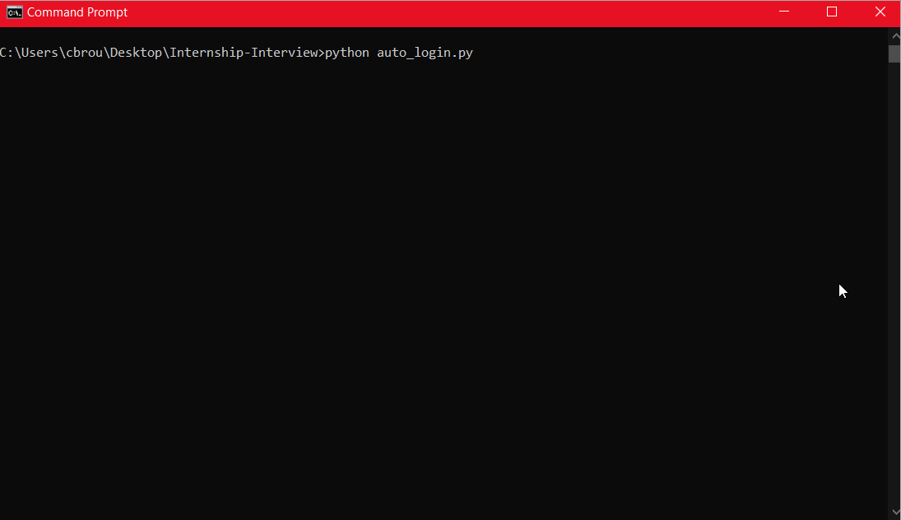

# Sign-Up and Log-In Testing

A simple respository of both manual and automated tests against the demoblaze website.

# Requirements
 - Python (Works and tested with version 3.10.0)
 - Chrome version 104.0.5112.79
 - The latest version of Selenium (use `pip install selenium` if not present)

# Files
## auto_login.py

The python script to run for automated testing. 

main() prepares the test environment by initializing a Chrome web driver instance and reading into users.txt to prepare login information before passing these to login() and passing returned values to log_result().

login() takes in a string `username`, string `password`, and WebDriver `browser` and uses them to sign into the demoblaze website. It detects if an alert appears on the webpage before determining if the login failed or succeeded.

log_result() takes in a boolean `result`, string `username`, and string `password` and writes login information to log.txt as well as to the console.

## users.txt
The file read for usernames and passwords. In each line, a username and password is separated by a comma with no additional spaces, like so:

`username,password`

This file can be altered to include more usernames and passwords. If this file is deleted, auto_login.py will throw an error and exit.

## log.txt
The file used to store information on login attempts. Every two lines stores basic information, with the first line dedicated to indicating the username and password tested and the second line indicating if the login succeeded or failed.

This file is automatically deleted and created each time auto_login.py is run.

## chromedriver.exe
This driver is used by Selenium in order to open up a browser and automate the logins.

## DemoBlaze Manual Testing.pdf
A series of manual tests on the Sign up and Log In flow. These are represented by two tables which specify what was tested and what the result was.

# Automated Login Usage
You can run the auto_login.py script by using `python auto_login.py` in a terminal or by running the script in your favorite Python IDE. **Ensure that all files in this repository are in the same directory before running.**

A demonstration of running this program through the Windows command line is embedded below as a gif.

Thank you for this opportunity!